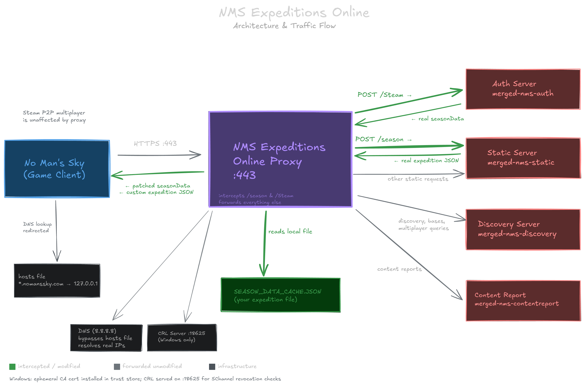

# NMS Expeditions Online

Play any old No Man's Sky expedition **online with full multiplayer** — see other players, visit the Anomaly, and play with friends.

This tool acts as a local proxy that intercepts the game's expedition/season data and replaces it with the expedition of your choice, while leaving all other game traffic (multiplayer, discovery services, bases) completely untouched.

## Table of Contents

- [How It Works](#how-it-works)
- [Requirements](#requirements)
- [Quick Start](#quick-start)
- [Important Warnings](#important-warnings)
- [Windows-Specific Details](#windows-specific-details)
- [How It Works (Technical Details)](#how-it-works-technical-details)
- [Building from Source](#building-from-source)
- [Troubleshooting](#troubleshooting)
- [Disclaimer](#disclaimer)
- [Credits](#credits)

## How It Works

No Man's Sky checks Hello Games' servers on startup to determine which expedition is currently active. This tool:

1. Redirects NMS API traffic to a local proxy (via your system's hosts file)
2. Intercepts the season/expedition data and replaces it with your chosen expedition
3. Patches the authentication response so the game believes your expedition is the active one
4. Forwards all other traffic (discovery services, bases, multiplayer) to the real servers untouched

**Multiplayer uses Steam's peer-to-peer networking**, which is completely unaffected by this tool.

## Requirements

- **No Man's Sky** (Steam, PC)
- An expedition JSON file from [cwmonkey's NMS Expeditions tool](https://cwmonkey.github.io/nms-expeditions/)
- **Administrator/root privileges** (required to modify the hosts file and listen on port 443)

## Quick Start

### Step 1: Download Your Expedition

1. Visit [cwmonkey's NMS Expeditions](https://cwmonkey.github.io/nms-expeditions/)
2. Select the expedition you want to play
3. Apply recommended patches (optional but suggested)
4. Download the `SEASON_DATA_CACHE.JSON` file

### Step 2: Set Up the Tool

#### Windows

1. Download `NMSExpeditionsOnline.exe` from the [Releases](../../releases) page
2. Place `SEASON_DATA_CACHE.JSON` in the **same folder** as the `.exe`
3. Double-click `NMSExpeditionsOnline.exe` (it will request administrator privileges)

#### Linux / Steam Deck

**Prerequisites:** Python 3.10+ (most distros ship with this)

**Option A — One command:**

1. [Download and extract the latest Linux release](https://github.com/BonzTM/nms-expeditions-online/releases/latest)
2. Place `SEASON_DATA_CACHE.JSON` in the project directory
3. Run:
   ```bash
   ./run.sh
   ```
   This handles sudo elevation, checks for Python, installs dependencies if needed, and starts the app.

**Option B — pip install:**

1. [Download and extract the latest Linux release](https://github.com/BonzTM/nms-expeditions-online/releases/latest)
2. Place `SEASON_DATA_CACHE.JSON` in the project directory
3. Install and run:
   ```bash
   pip install .
   sudo -E nms-expeditions-online
   ```

### Step 3: Install

1. Select **option 1 (Install)** from the menu
2. Confirm when prompted — this adds entries to your hosts file

### Step 4: Start the Proxy

1. Select **option 2 (Run)** from the menu
2. Wait for "Proxy is running!" to appear
3. **Launch No Man's Sky** through Steam as normal
4. You should see request logs in the proxy window (e.g., `POST https://merged-nms-auth.nomanssky.com/Steam`)
5. In-game you should see:
   - "Connected to Discovery Services" (not stuck on "Connecting")
   - Other players in the Anomaly
   - Your chosen expedition available to start

### Step 5: Play!

Play the expedition normally. Multiplayer, discovery services, and bases all work.

### When You're Done

1. Return to the tool window and press **Enter** to stop the proxy
2. Select **option 3 (Uninstall)** to restore your hosts file

## Important Warnings

### Do NOT uninstall mid-expedition

If you uninstall (remove the hosts file entries) while you have an active expedition save, **you will lose access to that expedition save**. The game will no longer recognize the expedition as active and you won't be able to continue it.

Only uninstall after you have:
- **Completed** the expedition and claimed your rewards, OR
- **Abandoned** the expedition save

### Switching expeditions

To switch to a different expedition:
1. Make sure you've completed or abandoned your current expedition
2. Stop the proxy
3. Replace the `SEASON_DATA_CACHE.JSON` file with the new expedition
4. Start the proxy again

## Windows-Specific Details

On Windows, the proxy performs additional setup to satisfy Windows' TLS requirements:

- **CA certificate installation** — The proxy generates a temporary CA certificate and installs it into the Windows Trusted Root Certificate Store using `certutil`. This is required because NMS uses Windows' native TLS stack (SChannel via libcurl), which validates server certificates against the OS store. The certificate is automatically removed when the proxy stops.

- **Certificate Revocation List (CRL)** — SChannel requires the ability to check whether certificates have been revoked. The proxy runs a small HTTP server on port 18625 that serves an empty CRL. The server certificate includes a CRL Distribution Point pointing to this server so SChannel's revocation check passes.

- **DNS cache flush** — After modifying the hosts file, the proxy runs `ipconfig /flushdns` to ensure Windows picks up the changes immediately.

- **Self-test** — On startup, the proxy verifies that DNS redirects are working, the TLS handshake succeeds, and (on Windows) that the certificate passes OS-level validation. If the self-test detects problems, it will report them before you launch the game.

None of this applies on Linux — Proton/Wine's TLS implementation does not perform strict certificate validation.

## How It Works (Technical Details)



**Traffic flow:**

1. The hosts file redirects NMS API hostnames to `127.0.0.1`
2. The proxy accepts the game's HTTPS connections on port 443
3. For `POST /season` — the proxy returns the custom expedition JSON directly (no upstream request needed)
4. For `POST /Steam` — the proxy forwards to the real auth server, then patches `seasonData` in the response
5. All other requests (discovery, bases, content reports) are forwarded to the real servers unmodified

**Hosts file entries:**

```
127.0.0.1 merged-nms-auth.nomanssky.com
127.0.0.1 merged-nms-static.nomanssky.com
127.0.0.1 merged-nms-discovery.nomanssky.com
127.0.0.1 merged-nms-contentreport.nomanssky.com
```

**TLS setup:**

- An ephemeral CA and server certificate are generated at startup
- The server certificate covers all four NMS hostnames via Subject Alternative Names
- On Windows, the CA cert is installed in the Trusted Root store and a CRL is served on port 18625 to satisfy SChannel's revocation checks
- On Linux, Proton/Wine's TLS does not validate certificates, so no CA installation is needed

## Building from Source

### Requirements

- Python 3.10+
- `cryptography` package (`pip install cryptography`)

### Running directly

```bash
pip install cryptography
sudo python3 -m nms_expeditions_online
```

### Building the Windows .exe

On a Windows machine:

```bash
pip install cryptography pyinstaller
python build.py
```

The executable will be in the `dist/` folder.

## Troubleshooting

### "Port 443 is already in use"

Something else is using port 443. Common culprits:
- **IIS** (Internet Information Services) on Windows
- **Apache/Nginx** web servers
- **Skype** (older versions)
- **VPN software**

Close the conflicting application and try again.

### "No expedition JSON file found"

Make sure `SEASON_DATA_CACHE.JSON` is in the same directory as the executable (Windows) or the project directory (Linux).

### Self-test reports "CERT VALIDATION FAILED" (Windows)

The proxy's CA certificate is not trusted by the OS. This usually means `certutil` failed to install it. Try:
- Make sure you accepted the UAC (administrator) prompt
- Check that no antivirus is blocking `certutil`
- Try running the tool from an elevated Command Prompt

### Self-test reports "DNS: hostname resolves to ... instead of 127.0.0.1"

The hosts file redirect is not taking effect. Try:
- Restart the DNS Client service: `net stop dnscache && net start dnscache`
- Reboot

### Game shows "No Active Expedition"

- Make sure the proxy is running (you should see "Proxy is running!" in the tool)
- Make sure you installed the hosts file entries (option 1)
- Restart NMS after starting the proxy — the game checks expedition data on startup

### Game says "Connecting to Discovery Services" and never connects

- Check that the proxy window shows connection logs (like `POST https://merged-nms-auth...`)
- If the proxy shows `[TLS ERROR]` messages, see the Windows-specific section above
- If the proxy is completely silent after launching the game, the hosts file redirect may not be working — check the self-test output
- Make sure no firewall is blocking connections to localhost port 443

### Multiplayer not working

Multiplayer uses Steam's networking and should work regardless. If you don't see other players:
- Check your Steam online status
- Make sure NMS multiplayer is enabled in the game's network settings
- Try visiting the Anomaly

## Disclaimer

This project is **not affiliated with, endorsed by, or associated with Hello Games** or No Man's Sky in any way. No Man's Sky is a trademark of Hello Games Limited.

This tool does **not** modify any game files, game memory, or game code. It operates solely at the network level by serving alternative expedition metadata through a local proxy. All multiplayer, discovery, and base-sharing traffic continues to Hello Games' servers unmodified.

That said, as with any other NMS mods or modding tools, use of this tool may conflict with the [No Man's Sky End User License Agreement](https://www.nomanssky.com/end-user-licence-agreement/). **Use this tool at your own risk.** The authors make no guarantees regarding account safety.

## Credits

- [cwmonkey's NMS Expeditions](https://cwmonkey.github.io/nms-expeditions/) — expedition data and patches
- Hello Games — No Man's Sky

## License

See [LICENSE](LICENSE) for details.
